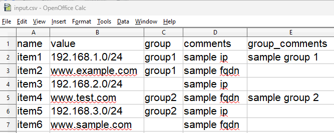
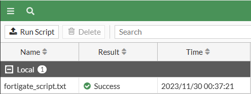
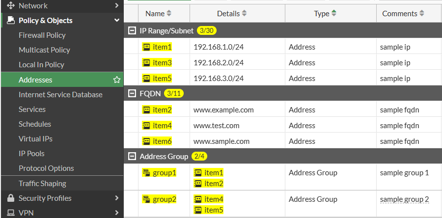

# FortiGate Address Script Generator

This Python script generates a Fortinet CLI script from a CSV file. The generated script can be used to create firewall address objects and address groups on a Fortinet device. **Note: This script currently only supports creating subnet or FQDN address types.**

## Input CSV File

The input file is a CSV file that serves as input to the script. Each row in the file represents a single firewall address object that you want to create on the Fortinet device. A sample template file is available in the project repository.

The CSV file should have the following columns:

- `name`: The name of the firewall address object.
- `value`: The IP address or FQDN of the firewall address object (this script currently only supports creating subnet or FQDN address types). If it's an IP address, it can optionally include a subnet mask in CIDR notation (e.g., `192.168.1.0/24`). If no subnet mask is provided, a `/32` will automatically be inserted. 
- `group`: The name of the address group that the firewall address object should be added to. If an address object should not be added to any group, this field can be left blank.
- `comments`: Any comments about the firewall address object. This field can be left blank.
- `group_comments`: Any comments about the address group. This field can be left blank.

The file should be selected in the GUI when running the script.

## Usage

1. Run the script: `python forti-address10.py`
2. In the GUI, click "Browse" next to "Input CSV" and select your CSV file.
3. Click "Browse" next to "Output File" and select where you want the output file to be saved.
4. Click "ENGAGE" to generate the script. 
5. Run the script on the FortiGate through GUI or CLI to import the address objects.

## Output

The script generates a Fortinet CLI script that can be used to create the firewall address objects and address groups specified in the input CSV file. The script is saved to the location specified in the GUI.

## Screenshots

### CSV File of Addresses to Import

### Program Execution

### Importing the Script into FortiGate

### Address Objects Imported into FortiGate

